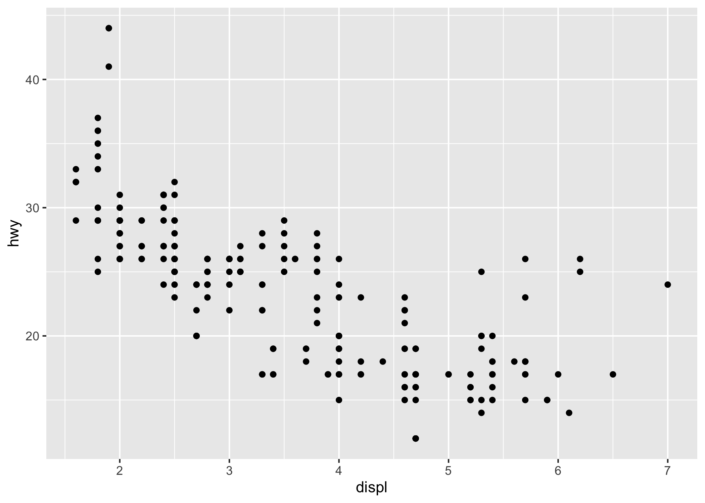
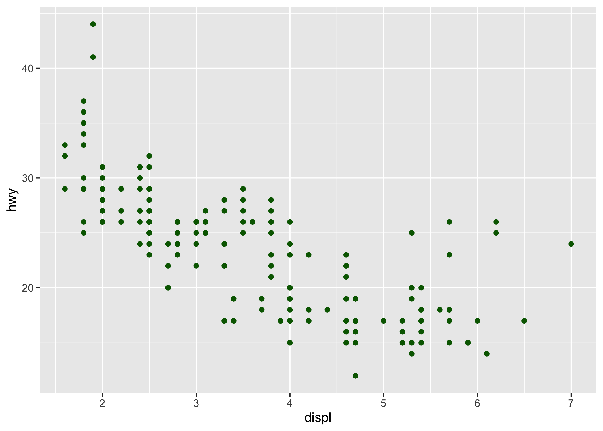
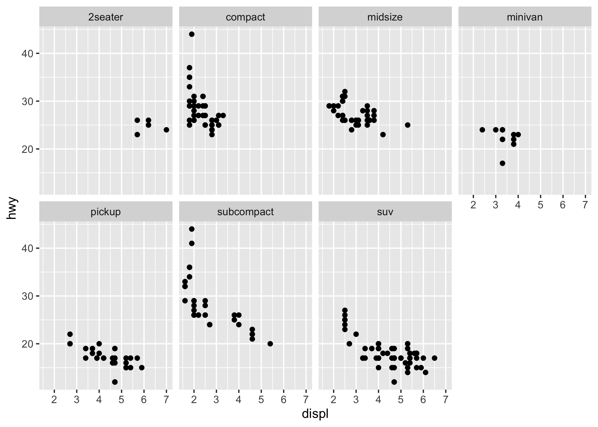

[Return to Main Page](../index.html)

<br><br>


## Table of Contents

[1 Common Data Manipulation with ``dplyr``](#the-deplyr-package)

[1.1 The ``nycflights13`` Dataset](#the-dataset)

[1.2 The ``filter()`` Function](#the-filter-function)

[1.2.1 Exercises](#exercises)

[1.3 The ``select()`` Function](#the-select-function)

[1.4 Create new variables with ``mutate()``](#create-new-variables-with-mutate)

[1.4.1 Mutate Exercises](#mutate-exercises)


-----------

[2 A New Grammar of Graphics ``ggplot2``](#a-new-grammar-of-graphics-ggplot2)

[2.1 The ``mpg`` Data Set](#the-mpg-data-set)

[2.2 A Basic Plot](#a-basic-plot)

[2.3 Saving Your Plots](#saving-your-plots)

[2.4 Enhancing Plot Aesthetics](#enhancing-plot-aesthetics)

[2.5 Using Facets](#using-facets)


<br><br><br><br><br>

## Getting the Flavor of *Tidyverse*

Tidyverse is a framework that provides complementary R packages for data wrangling, visualization and programming.  In this part of the workshop, we will visit a few of these packages and learn some of their functionality by following example data sets. This should useful whether you are a new R user or have experienced with functions available in base-R, the core group of R packages.


Let's begin by starting R-Studio and loading the tidyverse packages:

```r

load(tidyverse)

```


<br><br>

### 1. The dplyr Package


What are common data manipulation needs you might ask?  Consider the following:

1. Filter large data sets using multiple variables to suit your analysis

2. Reorder the rows of a very large spreadsheet so the ones you are interested in are at the top

3. Select only those columns for analysis that you need from numerous available

4. Create new variables on the fly by manipulating existing ones

deplyr provides functions (called 'verbs' here) that cater to each of these needs.  We will use the ``nycflights13`` data set to understand these verbs.

<br><br>

#### 1.1 The nycflights13 Dataset

```r

install.packages('nycflights13')

library(nycflights13)

```

This data set contains over 330,000 flights that arrived or departed from New York City in 2013.  It's a very large data frame consisting of 19 columns and 336,776 rows.  Run a quick overview of the data set as follows:

```r

flights

# A tibble: 336,776 x 19
    year month   day dep_time sched_dep_time dep_delay arr_time sched_arr_time
   <int> <int> <int>    <int>          <int>     <dbl>    <int>          <int>
 1  2013     1     1      517            515         2      830            819
 2  2013     1     1      533            529         4      850            830
 3  2013     1     1      542            540         2      923            850
 4  2013     1     1      544            545        -1     1004           1022
 5  2013     1     1      554            600        -6      812            837
 6  2013     1     1      554            558        -4      740            728
 7  2013     1     1      555            600        -5      913            854
 8  2013     1     1      557            600        -3      709            723
 9  2013     1     1      557            600        -3      838            846
10  2013     1     1      558            600        -2      753            745
# … with 336,766 more rows, and 11 more variables: arr_delay <dbl>,
#   carrier <chr>, flight <int>, tailnum <chr>, origin <chr>, dest <chr>,
#   air_time <dbl>, distance <dbl>, hour <dbl>, minute <dbl>, time_hour <dttm>

```

If you are familiar with the concept of data frames in R, you were probably cringing while typing ``flights`` at the prompt.  This is because invoking an entire data frame in R usually prints about 10,000 lines to the screen before it stops.  

The ``flights`` object here, although also a data frame, is one of a special type called ``tibble``.  The tibbles are a feature of the tidyverse.  In fact ``tibbles`` is a tidy package which reimagines the classical data frame so as to not overwhelm your R client.  It only prints basic information about the data set.  Any data frame can be converted to a tibble.

Note under each column name, there is an italicized abbreviation which tells you what type of data that column contains:

- ``int`` are integers
- ``dbl`` are real numbers
- ``chr`` are character vectors or strings
- ``dttm`` represents date time 
 

<br><br>

### 1.2 The ``filter()`` Function

Imagine you want to find out flights that arrived and departed on a specific day of the year.  Thus we have two variables at play here: 

- ``month`` 
- ``day of the month``

Both are coded as numerical data in this tibble.  The ``filter()`` function requires at least two arguments:

```r

filter(NAME_OF_TIBBLE, FILTERING_CONDITION1)

```

Let's say we want to find out everything about the flights that arrived/departed on Christmas day in 2013.  So you'd do:

```r

xmas <- filter(flights, month == 12, day == 25)


```

Note how this doesn't return any information to the screen.  That's because we sent the output of our command to a new variable called ``xmas``.

```r

xmas

# A tibble: 719 x 19
    year month   day dep_time sched_dep_time dep_delay arr_time sched_arr_time
   <int> <int> <int>    <int>          <int>     <dbl>    <int>          <int>
 1  2013    12    25      456            500        -4      649            651
 2  2013    12    25      524            515         9      805            814
 3  2013    12    25      542            540         2      832            850
 4  2013    12    25      546            550        -4     1022           1027
 5  2013    12    25      556            600        -4      730            745
 6  2013    12    25      557            600        -3      743            752
 7  2013    12    25      557            600        -3      818            831
 8  2013    12    25      559            600        -1      855            856
 9  2013    12    25      559            600        -1      849            855
10  2013    12    25      600            600         0      850            846
# … with 709 more rows, and 11 more variables: arr_delay <dbl>, carrier <chr>,
#   flight <int>, tailnum <chr>, origin <chr>, dest <chr>, air_time <dbl>,
#   distance <dbl>, hour <dbl>, minute <dbl>, time_hour <dttm>


```

Consider the number of observations here (n=719). That's how many flights arrived/departed from New York City on that day.  Essentially what you have done here is subsetted your data frame using two conditions.  


This was a trivial example, but in real world situations, queries can get pretty complicated.  Let's make it a tiny bit more complicated.  How about filtering the rows based on flights from two different months: April and August:


```r

AprAug <- filter(flights, month %in% c(4, 8))

AprAug


# A tibble: 57,657 x 19
    year month   day dep_time sched_dep_time dep_delay arr_time sched_arr_time
   <int> <int> <int>    <int>          <int>     <dbl>    <int>          <int>
 1  2013     4     1      454            500        -6      636            640
 2  2013     4     1      509            515        -6      743            814
 3  2013     4     1      526            530        -4      812            827
 4  2013     4     1      534            540        -6      833            850
 5  2013     4     1      542            545        -3      914            920
 6  2013     4     1      543            545        -2      921            927
 7  2013     4     1      551            600        -9      748            659
 8  2013     4     1      552            600        -8      641            701
 9  2013     4     1      553            600        -7      725            735
10  2013     4     1      554            600        -6      752            805
# … with 57,647 more rows, and 11 more variables: arr_delay <dbl>,
#   carrier <chr>, flight <int>, tailnum <chr>, origin <chr>, dest <chr>,
#   air_time <dbl>, distance <dbl>, hour <dbl>, minute <dbl>, time_hour <dttm>

```

During those two months, nearly 58000 flights operated out of New York City.  

Here is another example:

Let's find flights that neither arrived nor departed more than 30 mins late.  The variables in play here are:

- ``arr_delay``
- ``dep_delay``


```r

late30 <- filter(flights, arr_delay <= 30, dep_delay <= 30)

```  

<br>

#### 1.2.1 Exercises

1. Filter the number of flights that went to San Francisco (SFO) in February 2013.

2. Find flights that arrived at least 2 hours late

3. Filter flights operated by United Airlines in the months of November and December 2013

4. Among the three major airlines (United, American and Delta), which operated the most flights during sumemr months (July through August)


<br><br>


### 1.3 The ``select()`` Function

This function allows selecting on columns of interest.  With the ``nycflights13`` data set, we only have 19 columns, but big data sets often have hundreds if not thousands of columns.  To be able to subset such large data sets for only a few columns could be very useful.  Let's look at a few examples:


- First, if you want to check what all columns are present in the ``flights`` tibble, you can do this:

```r

names(flights)

 [1] "year"           "month"          "day"            "dep_time"      
 [5] "sched_dep_time" "dep_delay"      "arr_time"       "sched_arr_time"
 [9] "arr_delay"      "carrier"        "flight"         "tailnum"       
[13] "origin"         "dest"           "air_time"       "distance"      
[17] "hour"           "minute"         "time_hour"     

```


- Now consider that you are interested in the following data:

	- ``month``
	- ``carrier``
	- ``distance``

Here is how you'd subset the data:


```r

flights_sub1 <- select(flights, month, carrier, distance)

flights_sub1

# A tibble: 336,776 x 3
   month carrier distance
   <int> <chr>      <dbl>
 1     1 UA          1400
 2     1 UA          1416
 3     1 AA          1089
 4     1 B6          1576
 5     1 DL           762
 6     1 UA           719
 7     1 B6          1065
 8     1 EV           229
 9     1 B6           944
10     1 AA           733
# … with 336,766 more rows


```

Note that unlike ``filter()``, we are not actually subsetting the data in rows.  All rows are present in the subset.  It's just that now have only 3 columns in the subset as we needed.


- You can also select multiple columns if they appear in order.  For example, ``year``, ``month``, and ``day`` appear consecutively.  You could select for them as follows:

```r

flights_sub2 <- select(flights, year:day)

flights_sub2

# A tibble: 336,776 x 3
    year month   day
   <int> <int> <int>
 1  2013     1     1
 2  2013     1     1
 3  2013     1     1
 4  2013     1     1
 5  2013     1     1
 6  2013     1     1
 7  2013     1     1
 8  2013     1     1
 9  2013     1     1
10  2013     1     1
# … with 336,766 more rows

```

- You can also use the same method to select all columns other than the ones mentioned.


```r

flights_sub3 <- select(flights, -(year:day))

flights_sub3

# A tibble: 336,776 x 16
   dep_time sched_dep_time dep_delay arr_time sched_arr_time arr_delay carrier
      <int>          <int>     <dbl>    <int>          <int>     <dbl> <chr>  
 1      517            515         2      830            819        11 UA     
 2      533            529         4      850            830        20 UA     
 3      542            540         2      923            850        33 AA     
 4      544            545        -1     1004           1022       -18 B6     
 5      554            600        -6      812            837       -25 DL     
 6      554            558        -4      740            728        12 UA     
 7      555            600        -5      913            854        19 B6     
 8      557            600        -3      709            723       -14 EV     
 9      557            600        -3      838            846        -8 B6     
10      558            600        -2      753            745         8 AA     
# … with 336,766 more rows, and 9 more variables: flight <int>, tailnum <chr>,
#   origin <chr>, dest <chr>, air_time <dbl>, distance <dbl>, hour <dbl>,
#   minute <dbl>, time_hour <dttm>

```

<br><br>

### 1.4 Create New Variables with ``mutate()``

The ``mutate()`` function allows you to create new variables on the fly.  For example, consider that you wish to find all flights that were delayed and  simultaneously you wish to calculate the air speed of those flights.  What variables might you need for this?

- ``year``, ``month``, ``day``
- Delay information; so any columns ending in ``delay``
- And you need ``distance`` and ``air_time`` to calculate the speed.  

First, use the ``select()`` function to subset the flights tibble with the above info.


```r

flights_sml <- select(flights, year:day, ends_with("delay"), distance, air_time)

flights_sml

# A tibble: 336,776 x 7
    year month   day dep_delay arr_delay distance air_time
   <int> <int> <int>     <dbl>     <dbl>    <dbl>    <dbl>
 1  2013     1     1         2        11     1400      227
 2  2013     1     1         4        20     1416      227
 3  2013     1     1         2        33     1089      160
 4  2013     1     1        -1       -18     1576      183
 5  2013     1     1        -6       -25      762      116
 6  2013     1     1        -4        12      719      150
 7  2013     1     1        -5        19     1065      158
 8  2013     1     1        -3       -14      229       53
 9  2013     1     1        -3        -8      944      140
10  2013     1     1        -2         8      733      138
# … with 336,766 more rows


```

- Now you can use ``mutate()`` to calculate the speed as follows:

```r

flights_spd <- mutate(flights_sml, 
		speed = distance / air_time * 60)


flights_spd

# A tibble: 336,776 x 8
    year month   day dep_delay arr_delay distance air_time speed
   <int> <int> <int>     <dbl>     <dbl>    <dbl>    <dbl> <dbl>
 1  2013     1     1         2        11     1400      227  370.
 2  2013     1     1         4        20     1416      227  374.
 3  2013     1     1         2        33     1089      160  408.
 4  2013     1     1        -1       -18     1576      183  517.
 5  2013     1     1        -6       -25      762      116  394.
 6  2013     1     1        -4        12      719      150  288.
 7  2013     1     1        -5        19     1065      158  404.
 8  2013     1     1        -3       -14      229       53  259.
 9  2013     1     1        -3        -8      944      140  405.
10  2013     1     1        -2         8      733      138  319.
# … with 336,766 more rows


```

Notice the new column ``speed`` which appears in the newly created tibble.  The ``mutate()`` function added that column to show us the speed of each flight.


<br><br>


### 1.4.1 Mutate Exercises


1. Subset the ``flights`` tibble to include following columns: ``carrier``, ``arr_delay``, ``dep_delay``

2. Use ``mutate()`` to create a new variable called ``ground_time`` by adding the two delay columns

3. Then use ``filter()`` to calculate the number of flights for each of the 3 major airlines (United, American, Delta) where the ``ground_time`` was at least 2 hours.  


<br><br><br><br>

## 2. A New Grammar of Graphics ``ggplot2``

</img>


A very common complaint about plots made with base-R graphics is their blandness.  The basic plots are always drawn in black and white and with ugly fonts.  You can certainly customize them but that makes for more work.  When Hadley Wickham first came out with ``ggplot2`` as a new grammar of plotting, quickly became very popular.  Granted, it has a learning curve similar to learning a new language, but once you get past that initial discomfort, the default plots are publication quality.  

In this section, we will use a data set that is routinely used in demonstrating the capabilities of ggplot2 called ``mpg``.  The dataset lists fuel efficiencies of various makes of vehicles with varying features.  Let's take a quick look at the data set:


<br><br>

### 2.1 The ``mpg`` data set

```r

mpg

# A tibble: 234 x 11
   manufacturer model    displ  year   cyl trans   drv     cty   hwy fl    class
   <chr>        <chr>    <dbl> <int> <int> <chr>   <chr> <int> <int> <chr> <chr>
 1 audi         a4         1.8  1999     4 auto(l… f        18    29 p     comp…
 2 audi         a4         1.8  1999     4 manual… f        21    29 p     comp…
 3 audi         a4         2    2008     4 manual… f        20    31 p     comp…
 4 audi         a4         2    2008     4 auto(a… f        21    30 p     comp…
 5 audi         a4         2.8  1999     6 auto(l… f        16    26 p     comp…
 6 audi         a4         2.8  1999     6 manual… f        18    26 p     comp…
 7 audi         a4         3.1  2008     6 auto(a… f        18    27 p     comp…
 8 audi         a4 quat…   1.8  1999     4 manual… 4        18    26 p     comp…
 9 audi         a4 quat…   1.8  1999     4 auto(l… 4        16    25 p     comp…
10 audi         a4 quat…   2    2008     4 manual… 4        20    28 p     comp…
# … with 224 more rows


```

Compared to the ``nycflights13`` data set we used earlier, this is a pretty small tibble with 234 rows and 11 columns.  Consider two variables from the tibble:

- ``displ`` is displacement i.e. the size of the engine, and 
- ``hwy`` is highway mileage

We can visualize relationship between these two variables to compare the fuel efficiency of all makes and models. 

``ggplot2`` plots are built in stages, one layer at a time.  Try the following code and see what you get.


<br><br>

### 2.2 A basic plot

```r

ggplot(data=mpg)

``` 

The reason your plot is empty because we haven't told R which variables are to be plotted.  That would make the second layer of the plot as follows:


```r

ggplot(data=mpg) + geom_point(mapping=aes(x = displ, y = hwy))

```

<center>

</center>

The ``geom_point`` is a function in ggplot2 to make a scatterplot.  Ggplot provides a number of geom functions to plot lines (``geom_line``), histograms (``geom_hist``), barplots (``geom_bar``) etc. For more details, visit the [ggplot2 reference](https://ggplot2.tidyverse.org/reference/).

Before we move on, can you try making a scatterplot of highway mileage *vs* the number of combustion cylinders? What can you say about the relationship of these two variables?

<br><br>

### 2.3 Saving Your Plots

You can save your plots as follows.  Please save each plot, as you will use it later. Make sure to enclose the name inside quotes and to not use spaces within the name.

```r

ggsave("Name_of_Plot.png")

```

If you save the plot as above, ggplot will use dimensions of the plot as they are on your screen.  You can change this default behavior by explicitly providing size of the output plot in inches.


```r

ggsave("Name_of_Plot.png", width=7, height=5)

```

Of course, ``.png`` isn't the only format you can save the plots in.  Look at following examples: 

```r

ggsave("Name_of_Plot.pdf")

ggsave("Name_of_Plot.jpg")

ggsave("Name_of_Plot.svg")

```


<br><br>

### 2.4 Enhancing plot aesthetics

In the previous plot, we used the ``aes()`` function to assign the two axes, but it can also take additional arguments such as color of the points (or lines).  For example, we can assign colors to different types of vehicles:


```r

ggplot(data=mpg) + geom_point(mapping=aes(x = displ, y = hwy, colour=class))

```

<center>

</center>

Notice how ggplot2 not only automatically chooses colors for each vehicle class, but also draws a legend to explain color pairings. In this example, instead of assigning colors manually, we simply asked ggplot to use factors of the variable ``class`` to assign colors.  

- If you wanted to assign a uniform color to all the points, it won't then convey any information about the class of the vehicles.  Your legend will also not be useful.


```r

ggplot(data=mpg) + geom_point(mapping=aes(x = displ, y = hwy), colour = "darkgreen")

```


<center>

</center>


<br><br>


### 2.5 Using Facets

Above, we saw adding aesthetics as one way of adding more variables to the plot.  Facets is another way and particularly useful for categorical variables.  In order to do this, we need to add one more layer of the grammar to our existing plot. 

```r

ggplot(data=mpg) + 
	geom_point(mapping=aes(x = displ, y = hwy)) + 
	facet_wrap(~ class, nrow = 2)

```

<center>

</center>


Notice that we are not using colors here as it won't convey any additional information.  If you would stil like to color the points, add at option in as in one of the earlier plots.


